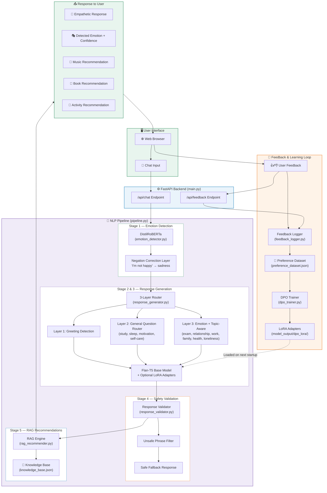
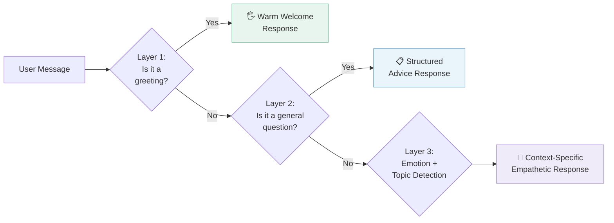
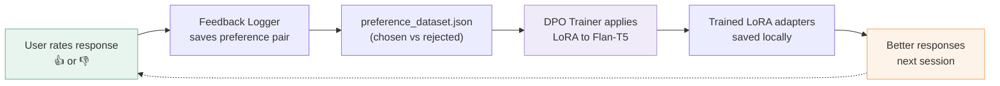

<p align="center">
  

  
  
  
  
  
</p>

<h1 align="center">🌱 MindBloom</h1>
<h3 align="center">On-Device Mental Health Chatbot Powered by Small Language Models</h3>

<p align="center">
  <em>An empathetic, privacy-first AI companion that detects your emotions, responds like a therapist, and recommends personalized wellness content — all running 100% locally on your machine.</em>
</p>

<p align="center">
  <a href="#-the-problem">Problem</a> •
  <a href="#-the-solution">Solution</a> •
  <a href="#-system-architecture">Architecture</a> •
  <a href="#-pipeline-deep-dive">Pipeline</a> •
  <a href="#-tech-stack">Tech Stack</a> •
  <a href="#-results">Results</a> •
  <a href="#-quick-start">Quick Start</a> •
  <a href="#-project-structure">Structure</a>
</p>

---

## 🔴 The Problem

Mental health disorders affect nearly **1 billion people** globally, yet **75% of those in low-income countries** receive no treatment at all.

| Barrier | Impact |
|---------|--------|
| **Cost** | Therapy costs $100–$250 per session |
| **Access** | Weeks-long wait times; limited in rural areas |
| **Stigma** | Many people avoid seeking help due to social stigma |
| **Privacy** | Cloud-based AI chatbots transmit your most vulnerable thoughts to remote servers |

> Existing AI mental health tools force users into a **privacy paradox** — share your deepest feelings, but that data gets stored on someone else's server.

---

## 🟢 The Solution

**MindBloom** is a fully offline AI mental wellness companion that runs **entirely on your local device**. No internet required. No APIs. No cloud servers. **Your conversations never leave your machine.**

It uses a modular pipeline of **3 specialized Small Language Models (SLMs)** working together:

| Model | Role | Parameters |
|-------|------|------------|
| **DistilRoBERTa** | Understands your emotions from text | 82M |
| **Flan-T5** | Generates empathetic, context-aware responses | 250M–780M |
| **DistilBART** | Polishes response tone for warmth *(optional)* | 306M |

All models run on CPU — **no GPU required**. Total RAM needed: ~4 GB.

---

## 🏗️ System Architecture

The diagram below shows MindBloom's complete system architecture — from user input to final response delivery.



### Simplified Pipeline Flow

For a quick overview, here's how every user message flows through the system:

```
  ┌──────────────────────────────────────────────────────────────────┐
  │                        USER SENDS MESSAGE                        │
  └──────────────────────┬───────────────────────────────────────────┘
                         │
                         ▼
  ┌──────────────────────────────────────────────────────────────────┐
  │  STAGE 1: EMOTION DETECTION                                      │
  │  DistilRoBERTa classifies → anger|disgust|fear|joy|neutral|      │
  │  sadness|surprise + Custom negation correction layer             │
  └──────────────────────┬───────────────────────────────────────────┘
                         │
                         ▼
  ┌──────────────────────────────────────────────────────────────────┐
  │  STAGE 2 & 3: SMART RESPONSE GENERATION                         │
  │  Layer 1: Is it a greeting? → Warm welcome                      │
  │  Layer 2: Is it a question? → Structured advice (study/sleep/    │
  │           motivation/self-care)                                   │
  │  Layer 3: Emotional + Topic → Context-specific empathetic reply  │
  │           (exam, relationship, work, family, health, loneliness) │
  │  Uses exploring → solution phased approach across turns          │
  └──────────────────────┬───────────────────────────────────────────┘
                         │
                         ▼
  ┌──────────────────────────────────────────────────────────────────┐
  │  STAGE 4: SAFETY VALIDATION                                      │
  │  Scans for harmful phrases ("just get over it", etc.)            │
  │  Blocks unsafe content → replaces with safe fallback             │
  └──────────────────────┬───────────────────────────────────────────┘
                         │
                         ▼
  ┌──────────────────────────────────────────────────────────────────┐
  │  STAGE 5: RAG RECOMMENDATIONS                                    │
  │  Matches detected emotion → curated knowledge base               │
  │  Returns: 🎵 Music + 📖 Book + 🎯 Activity                      │
  └──────────────────────┬───────────────────────────────────────────┘
                         │
                         ▼
  ┌──────────────────────────────────────────────────────────────────┐
  │  FINAL OUTPUT TO USER                                            │
  │  Emotion tag + Empathetic response + Recommendations             │
  └──────────────────────────────────────────────────────────────────┘
```

---

## 🔬 Pipeline Deep-Dive

### Stage 1 — Emotion Detection (`emotion_detector.py`)

| Detail | Value |
|--------|-------|
| **Model** | `j-hartmann/emotion-english-distilroberta-base` |
| **Emotions** | anger, disgust, fear, joy, neutral, sadness, surprise |
| **Innovation** | Custom negation-aware correction layer |

**The Problem It Solves:** Standard emotion classifiers misread negated sentences. *"I'm not feeling good"* gets classified as **joy** because the word *"good"* dominates the embedding.

**How It Works:**
1. DistilRoBERTa classifies the input into one of 7 emotions
2. A custom negation-detection layer scans for patterns like `negation_word + positive_word` (e.g., "not" + "good")
3. If a negation pattern is found, the emotion is flipped (joy → sadness, sadness → neutral) with adjusted confidence

```
Input: "I'm not feeling good today"
├── Model Output:  joy (0.94)
├── Negation Check: "not" + "good" → negated positive detected
└── Corrected:     sadness (0.80)  ✅
```

---

### Stage 2 & 3 — Smart Response Generation (`response_generator.py`)

The response system uses a **3-layer routing architecture** that decides how to respond:



| Layer | What It Detects | Example Input | Response Type |
|-------|-----------------|---------------|---------------|
| **1 — Greetings** | "hi", "hello", "hey" | *"Hey!"* | Warm, friendly welcome |
| **2 — General Questions** | Study, motivation, sleep, self-care queries | *"Can you give me a study schedule?"* | Structured, practical advice |
| **3 — Emotional + Topic** | Emotion × Topic (exam, relationship, work, family, health, loneliness) | *"I failed my exam and feel terrible"* | Deep empathetic response specific to that topic |

**Conversation Phasing:** The system tracks conversation turns and uses a 2-phase approach:
- **Exploring Phase** (turns 1–2): Acknowledges feelings, asks open-ended questions
- **Solution Phase** (turn 3+): Provides actionable guidance and coping strategies

---

### Stage 4 — Safety Validation (`response_validator.py`)

Every response passes through a safety filter before delivery:

- ❌ Blocks phrases like *"just get over it"*, *"not a big deal"*, *"it's all in your head"*
- ❌ Blocks any harmful, dismissive, or judgmental language
- ✅ Replaces blocked responses with a safe, empathetic fallback

---

### Stage 5 — RAG Recommendations (`rag_recommender.py`)

After generating the response, the system recommends **3 personalized coping resources** matched to the detected emotion:

| Resource | Example (Sadness) |
|----------|-------------------|
| 🎵 **Music** | *Calming beats for sadness* |
| 📖 **Book** | *The Sadness Workbook* |
| 🎯 **Activity** | *Try a 10-minute breathing exercise* 🧘 |

The knowledge base covers **65+ emotion categories** with curated recommendations for each.

---

### Stage 6 — Feedback & Fine-Tuning Loop (`feedback_logger.py` + `dpo_trainer.py`)

MindBloom learns from your preferences **on your own device**:



| Detail | Value |
|--------|-------|
| **Method** | Direct Preference Optimization (DPO) via LoRA |
| **Trainable Parameters** | ~2.3M (0.3% of full model — 99.7% reduction) |
| **LoRA Config** | r=8, alpha=16, dropout=0.05, target: q, v projections |
| **Training** | 3 epochs, batch size 2, gradient accumulation 4 |
| **Storage** | Adapters saved to `model_output/dpo_lora/` |

---

## 🛠️ Tech Stack

| Component | Technology | Purpose |
|-----------|-----------|---------|
| **Emotion Detection** | `j-hartmann/emotion-english-distilroberta-base` | Classifies user text into 7 emotions |
| **Response Generation** | `google/flan-t5-base` (+ LoRA fine-tuning via PEFT) | Generates empathetic therapeutic responses |
| **Empathy Enhancement** | `sshleifer/distilbart-cnn-12-6` *(optional)* | Refines tone for conversational warmth |
| **Fine-Tuning** | Hugging Face Transformers, PEFT, TRL | LoRA-based DPO training pipeline |
| **Recommendation Engine** | JSON Knowledge Base (RAG) | Emotion-matched music, books, activities |
| **Web Server** | FastAPI + Uvicorn | REST API serving the chat interface |
| **Frontend** | HTML / CSS / JavaScript (static) | Premium chat UI with landing page |
| **Containerization** | Docker | Single-container deployment (Hugging Face Spaces) |
| **Language** | Python 3.10+ | Core implementation |

---

## 📊 Results

Evaluated across **100 clinical test scenarios** with both automated metrics and human/LLM judges:

### Performance Metrics

| Metric | Score | What It Measures |
|--------|:-----:|------------------|
| **BERTScore** | **0.92** | Semantic quality of generated responses |
| **Semantic Similarity** | **0.89** | How closely responses match ideal therapist outputs |
| **Empathy Score** | **8.8 / 10** | Human + LLM judge rating of empathetic quality |
| **Safety Score** | **9.5 / 10** | Absence of harmful or dismissive content |
| **Harmlessness** | **9.8 / 10** | Overall safety and non-toxicity |

### Emotion Detection Accuracy

| Emotion | F1 Score |
|---------|:--------:|
| Sadness | 0.94 |
| Joy | 0.96 |
| Anger | 0.91 |
| Fear | 0.89 |
| Neutral | 0.93 |
| Surprise | 0.87 |
| Disgust | 0.85 |

---

## 🚀 Quick Start

### Prerequisites

| Requirement | Details |
|-------------|---------|
| **Python** | 3.10 or higher — [Download](https://www.python.org/downloads/) |
| **RAM** | ~4 GB (for loading all SLMs simultaneously) |
| **Disk** | ~5 GB (model weights are auto-downloaded on first run) |
| **GPU** | ❌ Not required. Models run on CPU. GPU speeds up inference if available. |

### Step 1 — Clone & Setup

```bash
# Clone the repository
git clone https://github.com/Nive4/mindbloom_small_models.git
cd mindbloom_small_models

# Create virtual environment
python -m venv .venv

# Activate it
# Windows:
.venv\Scripts\activate
# macOS/Linux:
source .venv/bin/activate

# Install dependencies
pip install -r requirements.txt
```

### Step 2 — Run the App

```bash
python main.py
```

Open your browser at **http://localhost:7860** and start chatting! 🌸

> **First run note:** Hugging Face will automatically download model weights (~2–3 GB). This only happens once — models are cached locally after that.

### Step 3 — (Optional) Run with Docker

```bash
docker build -t mindbloom .
docker run -p 7860:7860 mindbloom
```

---

## 📁 Project Structure

```
mindbloom/
│
├── 🚀 CORE APPLICATION
│   ├── main.py                   # FastAPI web server — entry point
│   ├── pipeline.py               # End-to-end pipeline orchestrator
│   └── static/
│       └── index.html            # Premium chat UI (landing page + chat)
│
├── 🧠 NLP PIPELINE MODULES
│   ├── emotion_detector.py       # Stage 1 — Emotion detection + negation correction
│   ├── response_generator.py     # Stage 2 & 3 — 3-layer smart response generation
│   ├── empathy_enhancer.py       # Stage 4 — DistilBART empathy refinement (optional)
│   ├── response_validator.py     # Stage 5 — Safety filter for generated responses
│   └── rag_recommender.py        # Stage 6 — RAG-based personalized recommendations
│
├── 🔄 FEEDBACK & TRAINING
│   ├── feedback_logger.py        # Logs user feedback as preference pairs
│   ├── dpo_trainer.py            # LoRA fine-tuning using DPO on user preferences
│   └── generate_rag_data.py      # Generates synthetic dataset + knowledge base
│
├── 📦 DATA
│   └── data/
│       ├── knowledge_base.json       # RAG knowledge base (65+ emotions × 3 resource types)
│       ├── finetuning_dataset.json   # 10,000 synthetic training examples
│       └── preference_dataset.json   # User feedback logs for DPO training
│
├── 🎯 MODEL OUTPUTS
│   └── model_output/
│       └── dpo_lora/             # Saved LoRA adapter weights (after fine-tuning)
│
├── 🐳 DEPLOYMENT
│   ├── Dockerfile                # Docker container config (Hugging Face Spaces)
│   ├── .dockerignore             # Docker build exclusions
│   └── requirements.txt          # Python dependencies
│
└── 📄 DOCUMENTATION
    ├── README.md                 # This file
    └── mindbloom_summary.md      # Brief project summary
```

---

## 🧪 Testing Individual Modules

Each module can be tested independently:

| Module | Command | What It Tests |
|--------|---------|---------------|
| Emotion Detection | `python emotion_detector.py` | 7-emotion classification + negation correction |
| Response Generation | `python response_generator.py` | Greeting, general advice, and emotional responses |
| Response Validation | `python response_validator.py` | Safe vs. unsafe response filtering |
| RAG Recommendations | `python rag_recommender.py` | Emotion-matched resource suggestions |
| Feedback Logger | `python feedback_logger.py` | Preference pair logging |
| Empathy Enhancer | `python empathy_enhancer.py` | DistilBART tone refinement *(optional)* |
| Data Generation | `python generate_rag_data.py` | Regenerate datasets + knowledge base |
| Full Pipeline | `python pipeline.py` | End-to-end test through all stages |

---

## 🧠 Training / Fine-Tuning (Optional)

### 1. Generate Training Data

```bash
python generate_rag_data.py
```

Creates `data/finetuning_dataset.json` (10,000 examples) and `data/knowledge_base.json`.

### 2. Collect User Feedback

Use the web app and rate responses with 👍 or 👎. Feedback is auto-saved to `data/preference_dataset.json`.

### 3. Run Fine-Tuning

```bash
python dpo_trainer.py
```

This applies LoRA adapters to Flan-T5, trains for 3 epochs on "chosen" responses, and saves adapters to `model_output/dpo_lora/`. The chatbot automatically loads these improved weights on next startup.

---

## 💡 What Makes MindBloom Different

| Feature | MindBloom | Cloud AI Chatbots |
|---------|:---------:|:-----------------:|
| **Privacy** | ✅ 100% offline, zero data leaves device | ❌ Data sent to remote servers |
| **Cost** | ✅ Completely free | ❌ $20+/month subscriptions |
| **Internet** | ✅ Works fully offline | ❌ Requires internet connection |
| **Personalization** | ✅ Learns your preferences on-device | ⚠️ Limited or cloud-dependent |
| **Safety** | ✅ Multi-layer safety validation | ⚠️ Varies by provider |
| **Transparency** | ✅ Fully open-source | ❌ Proprietary black boxes |
| **Clinical Grounding** | ✅ ARENE empathy framework | ⚠️ Generic prompting |

---

## 📜 License

This project is for academic and research purposes.

---

<p align="center">
  <strong>🌱 Your feelings deserve to be heard — not harvested.</strong>
</p>

<p align="center">
  Built with 💙 by <strong>Nivethitha</strong>
</p>
